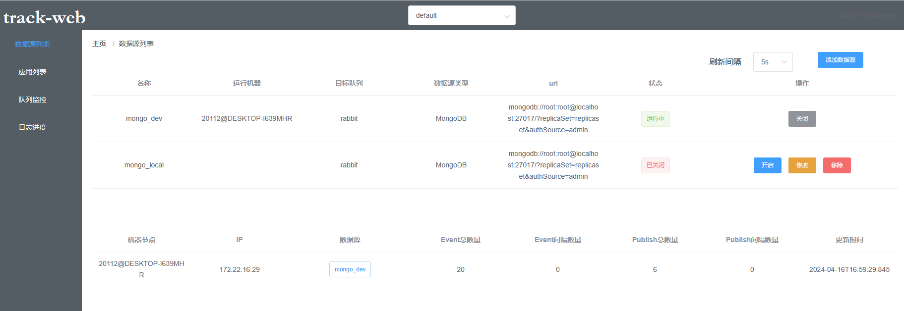

MongodbOpLog

高可用：多节点主备高可用，基于etcd、zookeeper领导选举
数据发布：rabbitmq，kafka
命名空间：数据环境应用隔离
可扩充多数据源：mongo、mysql（暂未支持）

track-web，dashboard 基于vuejs，可视化监控操作

**Server**

pom配置
```xml
<dependencies>
    <dependency>
        <groupId>com.github.shawven.calf</groupId>
        <artifactId>calf-track-server</artifactId>
        <version>0.0.1-SNAPSHOT</version>
    </dependency>
    <dependency>
        <groupId>com.github.shawven.calf</groupId>
        <artifactId>calf-track-register-etcd</artifactId>
        <version>0.0.1-SNAPSHOT</version>
    </dependency>
<!--    <dependency>-->
<!--        <groupId>com.github.shawven.calf</groupId>-->
<!--        <artifactId>calf-track-register-zookeeper</artifactId>-->
<!--        <version>0.0.1-SNAPSHOT</version>-->
<!--    </dependency>-->
</dependency>
```
yaml配置
```yaml
target-host: localhost
spring:
  redis:
    host: ${target-host}
    redisson:
      file: classpath:redisson.yml

  rabbitmq:
    apiUrl: http://${target-host}:15672/api/
    host: ${target-host}
    port: 5672
    username: guest
    password: guest
  
track:
  # 注册中心  
  etcd:
    url: http://${target-host}:2379
#  zookeeper:
#    url: ${target-host}:2181
```

**Client**

pom配置
```xml
<dependencies>
    <dependency>
        <groupId>com.github.shawven.calf</groupId>
        <artifactId>calf-track-client</artifactId>
        <version>0.0.1-SNAPSHOT</version>
    </dependency>
</dependencies>
```
yaml配置
```yaml
target-host: localhost
spring:
  redis:
    host: ${target-host}
    redisson:
      file: classpath:redisson.yml

  rabbitmq:
    apiUrl: http://${target-host}:15672/api/
    host: ${target-host}
    port: 5672
    username: guest
    password: guest

#服务端的地址
track.serverUrl: http://${target-host}:8888
```
注册bean
```java
@Bean
public DataSubscribeRegistry dataSubscribeRegistry()  {
    //初始化订阅的实现
    return new DataSubscribeRegistry()
            .setClientId(appName)
            .setServerUrl(serverUrl)
            .setDataConsumer(new RabbitDataConsumer(rabbitTemplate))
            .syncToServer();

}
```

例如：监听test表的t_user库 增删改事件
```java
@Service
public class ExampleHandlers {

    private static final Logger logger = LoggerFactory.getLogger(ExampleHandlers.class);

    @DataSubscriber(
            dataSource = "mongo_local",
            database = "test",
            table = "t_user",
            actions = {EventAction.INSERT, EventAction.UPDATE, EventAction.DELETE})
    public void handle1(String data) {
        logger.info("handle1 接收信息:" + data);
    }
    
    @DataSubscriber(
            dataSource = "mongo_dev",
            database = "test",
            table = "t_user",
            actions = {EventAction.INSERT, EventAction.UPDATE, EventAction.DELETE})
    public void handle2(String data) {
        logger.info("handle2 接收信息:" + data);
    }
}

```
启动server
```text
2024-04-16 16:55:02.409  INFO 35428 --- [           main] c.g.s.c.t.client.DataSubscribeRegistry   : startConsumers
2024-04-16 16:55:02.694  INFO 35428 --- [           main] c.g.s.c.t.client.DataSubscribeRegistry   : successfully startConsumers
2024-04-16 16:55:02.694  INFO 35428 --- [           main] c.g.s.c.track.server.TrackServerRunner   : starting trackServer
2024-04-16 16:55:03.482  INFO 35428 --- [           main] c.g.s.c.track.server.TrackServerRunner   : trackServer MongoDB started
2024-04-16 16:55:03.510  INFO 35428 --- [           main] c.g.s.c.t.e.EtcdRabbitExampleApplication : Started EtcdRabbitExampleApplication in 8.945 seconds (JVM running for 40.166)
2024-04-16 16:55:04.256  INFO 35428 --- [nio-8885-exec-1] o.a.c.c.C.[Tomcat].[localhost].[/]       : Initializing Spring DispatcherServlet 'dispatcherServlet'
2024-04-16 16:55:04.256  INFO 35428 --- [nio-8885-exec-1] o.s.web.servlet.DispatcherServlet        : Initializing Servlet 'dispatcherServlet'
2024-04-16 16:55:04.259  INFO 35428 --- [nio-8885-exec-1] o.s.web.servlet.DispatcherServlet        : Completed initialization in 3 ms
2024-04-16 16:55:13.438  INFO 35428 --- [onPool-worker-1] c.g.s.c.t.d.api.AbstractTrackServer      : command successfully started namespace：default, name:mongo_dev
2024-04-16 16:55:13.451  INFO 35428 --- [pool-6-thread-1] c.g.s.c.t.register.election.Election     : mongo_dev:35428@DESKTOP-I639MHR start elect
2024-04-16 16:55:13.522  INFO 35428 --- [pool-6-thread-1] c.g.s.c.t.register.election.Election     : mongo_dev:35428@DESKTOP-I639MHR grant leaseId 7587878064731180947
2024-04-16 16:55:13.797  INFO 35428 --- [pool-6-thread-1] c.g.s.c.t.register.election.Election     : mongo_dev:35428@DESKTOP-I639MHR campaignResponse elect:/track/leader/default/mongo_dev:35428@DESKTOP-I639MHR LeaderKey:/track/leader/default/mongo_dev:35428@DESKTOP-I639MHR/694d8ee5c747cf93, cost:346.0 ms
2024-04-16 16:55:13.849  INFO 35428 --- [pool-6-thread-1] org.mongodb.driver.cluster               : Adding discovered server localhost:27017 to client view of cluster
2024-04-16 16:55:13.851  INFO 35428 --- [pool-6-thread-1] org.mongodb.driver.client                : MongoClient with metadata {"driver": {"name": "mongo-java-driver|sync", "version": "4.6.1"}, "os": {"type": "Windows", "name": "Windows 10", "architecture": "amd64", "version": "10.0"}, "platform": "Java/Oracle Corporation/1.8.0_231-b11"} created with settings MongoClientSettings{readPreference=primary, writeConcern=WriteConcern{w=null, wTimeout=null ms, journal=null}, retryWrites=true, retryReads=true, readConcern=ReadConcern{level=null}, credential=MongoCredential{mechanism=null, userName='root', source='admin', password=<hidden>, mechanismProperties=<hidden>}, streamFactoryFactory=null, commandListeners=[], codecRegistry=ProvidersCodecRegistry{codecProviders=[ValueCodecProvider{}, BsonValueCodecProvider{}, DBRefCodecProvider{}, DBObjectCodecProvider{}, DocumentCodecProvider{}, IterableCodecProvider{}, MapCodecProvider{}, GeoJsonCodecProvider{}, GridFSFileCodecProvider{}, Jsr310CodecProvider{}, JsonObjectCodecProvider{}, BsonCodecProvider{}, EnumCodecProvider{}, com.mongodb.Jep395RecordCodecProvider@cbea0df]}, clusterSettings={hosts=[localhost:27017], srvServiceName=mongodb, mode=MULTIPLE, requiredClusterType=REPLICA_SET, requiredReplicaSetName='replicaset', serverSelector='null', clusterListeners='[]', serverSelectionTimeout='30000 ms', localThreshold='30000 ms'}, socketSettings=SocketSettings{connectTimeoutMS=10000, readTimeoutMS=0, receiveBufferSize=0, sendBufferSize=0}, heartbeatSocketSettings=SocketSettings{connectTimeoutMS=10000, readTimeoutMS=10000, receiveBufferSize=0, sendBufferSize=0}, connectionPoolSettings=ConnectionPoolSettings{maxSize=100, minSize=0, maxWaitTimeMS=120000, maxConnectionLifeTimeMS=0, maxConnectionIdleTimeMS=0, maintenanceInitialDelayMS=0, maintenanceFrequencyMS=60000, connectionPoolListeners=[], maxConnecting=2}, serverSettings=ServerSettings{heartbeatFrequencyMS=10000, minHeartbeatFrequencyMS=500, serverListeners='[]', serverMonitorListeners='[]'}, sslSettings=SslSettings{enabled=false, invalidHostNameAllowed=false, context=null}, applicationName='null', compressorList=[], uuidRepresentation=UNSPECIFIED, serverApi=null, autoEncryptionSettings=null, contextProvider=null}
2024-04-16 16:55:13.854  INFO 35428 --- [localhost:27017] org.mongodb.driver.connection            : Opened connection [connectionId{localValue:4, serverValue:65}] to localhost:27017
2024-04-16 16:55:13.854  INFO 35428 --- [localhost:27017] org.mongodb.driver.connection            : Opened connection [connectionId{localValue:3, serverValue:66}] to localhost:27017
2024-04-16 16:55:13.855  INFO 35428 --- [localhost:27017] org.mongodb.driver.cluster               : Monitor thread successfully connected to server with description ServerDescription{address=localhost:27017, type=REPLICA_SET_PRIMARY, state=CONNECTED, ok=true, minWireVersion=0, maxWireVersion=13, maxDocumentSize=16777216, logicalSessionTimeoutMinutes=30, roundTripTimeNanos=3606200, setName='replicaset', canonicalAddress=localhost:27017, hosts=[localhost:27017], passives=[], arbiters=[], primary='localhost:27017', tagSet=TagSet{[]}, electionId=7fffffff0000000000000008, setVersion=1, topologyVersion=TopologyVersion{processId=661e2808fd47cdf6ae0ee0cf, counter=6}, lastWriteDate=Tue Apr 16 16:55:08 CST 2024, lastUpdateTimeNanos=469073731634100}
2024-04-16 16:55:13.857  INFO 35428 --- [localhost:27017] org.mongodb.driver.cluster               : Setting max election id to 7fffffff0000000000000008 from replica set primary localhost:27017
2024-04-16 16:55:13.857  INFO 35428 --- [localhost:27017] org.mongodb.driver.cluster               : Setting max set version to 1 from replica set primary localhost:27017
2024-04-16 16:55:13.857  INFO 35428 --- [localhost:27017] org.mongodb.driver.cluster               : Discovered replica set primary localhost:27017
2024-04-16 16:55:14.130  INFO 35428 --- [readScheduler-1] c.g.s.c.t.datasource.mongo.OplogClient   : oplog watch starting
2024-04-16 16:55:14.145  INFO 35428 --- [readScheduler-1] c.g.s.c.t.datasource.mongo.OplogClient   : latest timestamp is Timestamp{value=7358384124672868353, seconds=1713257312, inc=1}
2024-04-16 16:55:14.224  INFO 35428 --- [pool-6-thread-1] c.g.s.c.t.register.election.Election     : mongo_dev:35428@DESKTOP-I639MHR has successfully exec isLeader
2024-04-16 16:55:14.451  INFO 35428 --- [readScheduler-1] org.mongodb.driver.connection            : Opened connection [connectionId{localValue:5, serverValue:67}] to localhost:27017
2024-04-16 16:55:16.650  INFO 35428 --- [readScheduler-1] c.g.s.c.t.s.p.r.RabbitDataPublisher      : 推送信息 {"database":"test","destQueue":"rabbit","dsName":"mongo_dev","eventAction":"INSERT","namespace":"default","rowMaps":[{"_id":{"date":1713257707000,"timestamp":1713257707},"name":"张三","age":18}],"table":"t_user","timestamp":1713257716629,"uuid":"5da585e9-8036-4d64-b295-af2332e26a63"}
2024-04-16 16:55:16.670  INFO 35428 --- [readScheduler-1] c.g.s.c.t.s.p.r.RabbitDataPublisher      : 推送信息 {"database":"test","destQueue":"rabbit","dsName":"mongo_dev","eventAction":"UPDATE","namespace":"default","rows":[{"beforeRowMap":{"_id":{"date":1713256881000,"timestamp":1713256881}}}],"table":"t_user","timestamp":1713257716659,"uuid":"46c24b2c-6329-4938-a480-f2021ca187d7"}
2024-04-16 16:55:16.681  INFO 35428 --- [readScheduler-1] c.g.s.c.t.s.p.r.RabbitDataPublisher      : 推送信息 {"database":"test","destQueue":"rabbit","dsName":"mongo_dev","eventAction":"DELETE","namespace":"default","rowMaps":[{"_id":{"date":1713256881000,"timestamp":1713256881}}],"table":"t_user","timestamp":1713257716676,"uuid":"301105b3-fa8f-4b67-a6a7-cb121bdddc77"}

```
启动client
```text
2024-04-16 16:57:53.382  INFO 20112 --- [pool-4-thread-7] c.g.s.c.track.examples.ExampleHandlers   : handle2 接收信息:{"database":"test","destQueue":"rabbit","dsName":"mongo_dev","eventAction":"INSERT","namespace":"default","rowMaps":[{"_id":{"date":1713257873000,"timestamp":1713257873},"name":"张三","age":18}],"table":"t_user","timestamp":1713257873380,"uuid":"6dcca079-91f1-482f-9a8c-ee353878bc46"}
2024-04-16 16:57:53.758  INFO 20112 --- [pool-4-thread-8] c.g.s.c.track.examples.ExampleHandlers   : handle2 接收信息:{"database":"test","destQueue":"rabbit","dsName":"mongo_dev","eventAction":"UPDATE","namespace":"default","rows":[{"beforeRowMap":{"_id":{"date":1713257284000,"timestamp":1713257284}}}],"table":"t_user","timestamp":1713257873756,"uuid":"9ea4d3ec-451c-4fbf-a097-0807c0ca64d4"}
2024-04-16 16:57:54.118  INFO 20112 --- [pool-4-thread-9] c.g.s.c.track.examples.ExampleHandlers   : handle2 接收信息:{"database":"test","destQueue":"rabbit","dsName":"mongo_dev","eventAction":"DELETE","namespace":"default","rowMaps":[{"_id":{"date":1713257284000,"timestamp":1713257284}}],"table":"t_user","timestamp":1713257874115,"uuid":"531c4d40-1879-4c1d-b1b6-f4df608a09c4"}

```
web界面

